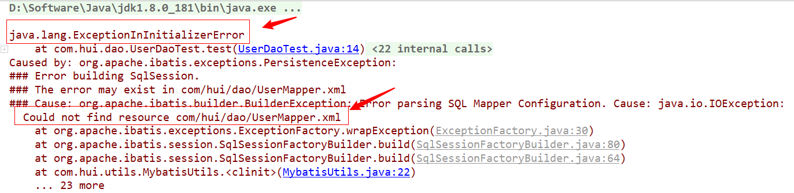
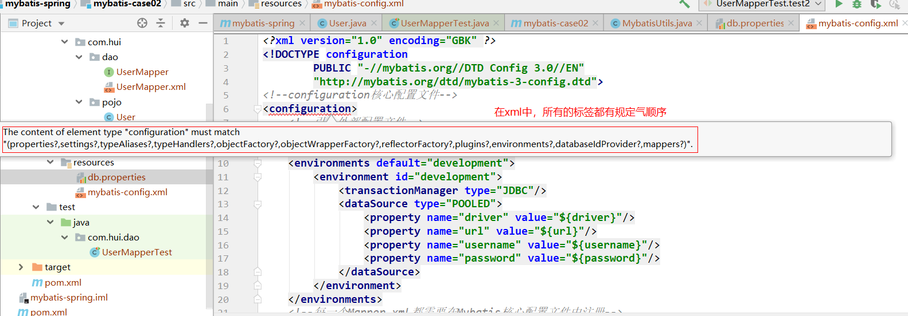
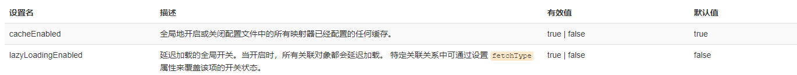
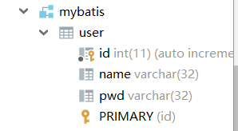
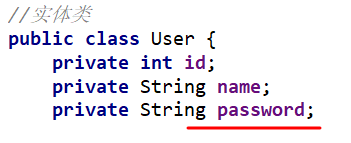
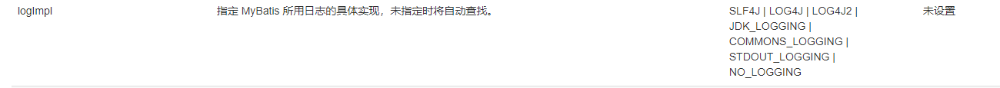
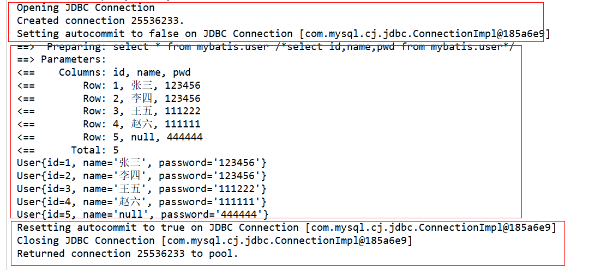
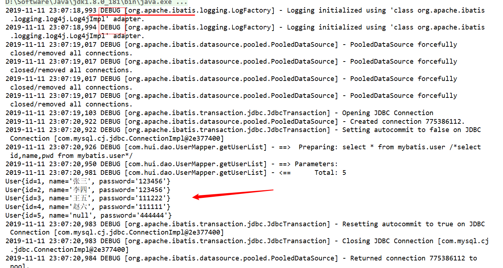

# 1、简介

### 1.1、什么是 MyBatis？

1. MyBatis 是一款优秀的**持久层**框架，它支持定制化 SQL、存储过程以及高级映射。
2. MyBatis 避免了几乎所有的 JDBC 代码和手动设置参数以及获取结果集。
3. MyBatis 可以使用简单的 XML 或注解来配置和映射原生类型、接口和 Java 的 POJO（Plain Old Java Objects，普通老式 Java 对象）为数据库中的记录。 

### 1.2、如何获得Mybatis：

- Github：https://github.com/mybatis/mybatis-3/releases

- 中文文档：https://mybatis.org/mybatis-3/zh/index.html

- maven仓库:

  ```xml
  <!-- https://mvnrepository.com/artifact/org.mybatis/mybatis -->
  <dependency>
      <groupId>org.mybatis</groupId>
      <artifactId>mybatis</artifactId>
      <version>3.5.3</version>
  </dependency>
  
  ```

### 1.3、持久层

数据持久化

- 持久化就是将程序的数据在持久状态和瞬时状态转化的过程
- 内存：断电即失
- 数据库（JDBC）、io文件持久化
- 生活：冷藏，罐头

为什么需要持久化？

- 有一些对象，不能让他丢掉
- 内存昂贵

### 1.4、持久层

Dao层、Serviceceng、Controllerceng

- 完成持久化工作的代码块
- 层界限十分明显

### 1.5、为什么需要Mybatis？

- 方便
- 简化传统JDBC代码，框架，自动化
- 不用Mybatis也可以
- 优点：
  - 简单易学
  - 灵活
  - 解除sql与程序代码的耦合，提高可维护性
  - 提供映射标签，支持对象与数据库的orm字段关系映射
  - 提供对象关系映射标签，支持对象关系组建维护
  - 提供xml标签，支持编写动态sql。


# 2、第一个Mybatis程序

思路：搭建环境-->导入Mybatis-->编写代码-->测试

### 2.1、搭建环境

搭建数据库：

```sql
CREATE DATABASE mybatis;
USE mybatis;

CREATE TABLE USER(
	id INT PRIMARY KEY AUTO_INCREMENT,
	NAME VARCHAR(32),
	pwd VARCHAR(32)
);

INSERT INTO USER(id,NAME,pwd) VALUES(NULL,'张三','123456'),(NULL,'李四','123456'),(NULL,'王五','111222');
```

新建项目：

1. 新建一个普通的maven项目

2. 删除src目录，就编程一个父工程了（然后新建一个模块，父工程导入的依赖，可以方便子项目使用，不用再导了）

3. 导入maven依赖

   ```xml
   <!--导入依赖-->
   <dependencies>
       <dependency>
           <groupId>mysql</groupId>
           <artifactId>mysql-connector-java</artifactId>
           <version>8.0.18</version>
       </dependency>
       <dependency>
           <groupId>junit</groupId>
           <artifactId>junit</artifactId>
           <version>4.12</version>
       </dependency>
       <dependency>
           <groupId>org.mybatis</groupId>
           <artifactId>mybatis</artifactId>
           <version>3.5.3</version>
       </dependency>
   </dependencies>
   ```

### 2.2、创建一个模块

- 编写mybatis的核心配置文件

  ```xml
  <?xml version="1.0" encoding="UTF-8" ?>
  <!DOCTYPE configuration
          PUBLIC "-//mybatis.org//DTD Config 3.0//EN"
          "http://mybatis.org/dtd/mybatis-3-config.dtd">
  <!--configuration核心配置文件-->
  <configuration>
      <environments default="development">
          <environment id="development">
              <transactionManager type="JDBC"/>
              <dataSource type="POOLED">
                  <property name="driver" value="com.mysql.cj.jdbc.Driver"/>
                  <property name="url" value="jdbc:mysql://localhost:3306/mybatis?useSSl=true&amp;useUnicode=true&amp;characterEncoding=UTF-8&amp;serverTimezone=GMT2B8"/>
                  <property name="username" value="root"/>
                  <property name="password" value="@dmin123"/>
              </dataSource>
          </environment>
      </environments>
  
  </configuration>
  ```

- 编写mybatis工具类

  ```java
  //sqlSessionFactory-->sqlSession
  public class MybatisUtils {
  
      private static SqlSessionFactory sqlSessionFactory;
  
      static{
  
          try {
              //使用Mybatis第一步：获取sqlSessionFactory对象
              String resource = "mybatis-config.xml";
              InputStream inputStream = Resources.getResourceAsStream(resource);
              sqlSessionFactory = new SqlSessionFactoryBuilder().build(inputStream);
          } catch (IOException e) {
              e.printStackTrace();
          }
      }
  
      //既然有了 SqlSessionFactory，顾名思义，我们就可以从中获得 SqlSession 的实例了。
      //SqlSession 完全包含了面向数据库执行 SQL 命令所需的所有方法。
      public static SqlSession getSqlSession(){
          return sqlSessionFactory.openSession();
      }
  
  }
  ```

### 2.3、编写代码

- 实体类

  ```java
  //实体类
  public class User implements Serializable {
      private int id;
      private String name;
      private String pwd;
  
      public User() {
      }
  
      public User(int id, String name, String pwd) {
          this.id = id;
          this.name = name;
          this.pwd = pwd;
      }
  
      public int getId() {
          return id;
      }
  
      public void setId(int id) {
          this.id = id;
      }
  
      public String getName() {
          return name;
      }
  
      public void setName(String name) {
          this.name = name;
      }
  
      public String getPwd() {
          return pwd;
      }
  
      public void setPwd(String pwd) {
          this.pwd = pwd;
      }
  }
  ```

- Dao接口

  ```java
  public interface UserDao {
      List<User> getUserList();
  }
  ```

- 接口实现类由原来的UserDaoImpl转变为一个Mapper配置文件

  ```xml
  <?xml version="1.0" encoding="UTF-8" ?>
  <!DOCTYPE mapper
          PUBLIC "-//mybatis.org//DTD Mapper 3.0//EN"
          "http://mybatis.org/dtd/mybatis-3-mapper.dtd">
  
  <!--namespace=绑定一个对应的Dao/Mapper接口-->
  <mapper namespace="com.hui.dao.UserDao">
      <!--select查询语句-->
      <select id="getUserList" resultType="com.hui.pojo.User">
          select * from mybatis.user
      </select>
  </mapper>
  ```

### 2.4、测试

注意点：

org.apache.ibatis.binding.BindingException: Type interface com.hui.dao.UserDao is not known to the MapperRegistry.

**MapperRegistry是什么？**核心配置文件中注册mappers




**maven由于他的约定大于配置，之后可能遇到写的配置文件，无法被导出或者生效的问题**，解决方案：

```xml
<!--在build中配置resources，来防止我们资源导出失败的问题-->
    <build>
        <resources>
            <resource>
                <directory>src/main/resources</directory>
                <includes>
                    <include>**/*.properties</include>
                    <include>**/*.xml</include>
                </includes>
                <filtering>true</filtering>
            </resource>
            <resource>
                <directory>src/main/java</directory>
                <includes>
                    <include>**/*.properties</include>
                    <include>**/*.xml</include>
                </includes>
                <filtering>true</filtering>
            </resource>
        </resources>
    </build>
```


Cause: com.sun.org.apache.xerces.internal.impl.io.MalformedByteSequenceException: 3 字节的 UTF-8 序列的字节 3 无效。

解决：解析xml时，有中文，此时把xml文件的头

<?xml version="1.0" encoding="UTF-8"?>

改成：

<?xml version="1.0" encoding="GBK"?>

即可！


- junit测试

  ```java
  @Test
  public void test2(){
      //获取sqlSession对象
      SqlSession sqlSession = MybatisUtils.getSqlSession();
      //方式一：getMapper
      UserMapper mapper = sqlSession.getMapper(UserMapper.class);
      List<User> users = mapper.getUserList();
  
      for(User user:users){
          System.out.println(user);
      }
      //关闭sqlSession
      sqlSession.close();
  }
  ```

  

可能遇到的问题：

- 配置文件没有注册
- 绑定接口错误
- 方法名不对
- 返回类型不对
- Maven导出资源问题


# 3、CRUD

### 1、namespace

namespace中的包名要和Dao/Mapper接口的包名一致

### 2、select

选择查询语句：

- id：就是对应的namespace的方法名
- resultType：sql语句执行的返回值
- parademeterType：参数类型

步骤：

1. 编写接口

   ```java
   //根据id查询用户
   User getUserById(int id);
   ```

2. 编写对应的mapper中的sql语句

   ```xml
   <select id="getUserById" parameterType="int" resultType="com.hui.pojo.User">
       select * from mybatis.user where id=#{id}
   </select>
   ```

3. 测试

   ```java
   @Test
       public void getUserById(){
           SqlSession sqlSession = MybatisUtils.getSqlSession();
           UserMapper mapper = sqlSession.getMapper(UserMapper.class);
           User user = mapper.getUserById(3);
           System.out.println(user);
           sqlSession.close();
       }
   ```

### 3、insert

### 4、update

### 5、delete

**注意：增删改需要提交事务！**


### 6、Map（扩展知识）

假设，实体类或者数据库中的表，字段或者参数过多，应当考虑使用Map！

```java
int addUser2(Map<String,Object> map);
```

```xml
<insert id="addUser2" parameterType="map">
    insert into mybatis.user (id,pwd) values (#{userid},#{password})
</insert>
```

```java
@Test
    public void addUser2(){
        SqlSession sqlSession = MybatisUtils.getSqlSession();
        UserMapper mapper = sqlSession.getMapper(UserMapper.class);

        HashMap<String, Object> map = new HashMap<String, Object>();
        map.put("userid",5);
        map.put("password","444444");

        mapper.addUser2(map);

        sqlSession.commit();
        sqlSession.close();
    }
```

- Map传递参数，直接在sql中取出key即可	【parametertype="map"】
- 对象传递参数，直接在sql中取对象的属性即可【parameterType="对象"】
- 只要一个基本类型参数的情况下，可以直接在sql中取到
- 多个参数用Map，或者**注解**


# 4、配置解析

### 1、核心配置文件

- mybatis-config.xml

-  MyBatis 的配置文件包含了会深深影响 MyBatis 行为的设置和属性信息。 

  ```
  configuration（配置）
  properties（属性）
  settings（设置）
  typeAliases（类型别名）
  typeHandlers（类型处理器）
  objectFactory（对象工厂）
  plugins（插件）
  environments（环境配置）
  environment（环境变量）
  transactionManager（事务管理器）
  dataSource（数据源）
  databaseIdProvider（数据库厂商标识）
  mappers（映射器）
  ```

### 2、环境配置（environments）

Mybatis可以配置成适应多种环境

注意：尽管可以配置多个环境，但每个SqlSessionFactory实例只能选择一种环境

Mybaits默认的事务管理器就是JDBC，连接池：POOLED

### 3、属性（properties）



编写一个配置文件：

```
driver=com.mysql.cj.jdbc.Driver
url=jdbc:mysql://localhost:3306/mybatis?serverTimezone=GMT%2B8
username=root
password=@dmin123
```

在核心配置文件中映入:

```xml
<!--引入外部配置文件-->
<properties resource="db.properties">
    <!--也可以部分写在配置文件中，部分写在这边-->
    <property name="username" value="root"/>
</properties>
```

- 可以直接引入外部文件
- 可以在其中增加一些属性配置
- 如果两个文件由同一个字段，优先使用外部配置文件的


### 4、类型别名（typeAliases）

- 类型别名是为java类型设置一个短的名字，存在意义仅用来减少类完全限定名的冗余

  ```xml
  <!--可以给实体类起别名-->
  <typeAliases>
      <typeAlias type="com.hui.pojo.User" alias="User"/>
  </typeAliases>
  <typeAliases>
  ```

- 也可以指定一个包名，Mybatis会在包名下面搜索需要的java Bean，如：扫描实体类的包，它的默认别名 就为这个类的类名，首字母小写

  ```xml
  <typeAliases>
      <typeAlias type="com.hui.pojo.User"/>
  </typeAliases>
  ```

在实体类较少时使用第一种；

如果实体类十分多，建议使用第二种；

第一种可以自定义别名；第二种不行，要改，则需要在实体上增加注解。

```java
@Alias("hello")
public class User {}
```


### 5、设置（settings）

 这是 MyBatis 中极为重要的调整设置，它们会改变 MyBatis 的运行时行为。 





### 6、其他配置

- [typeHandlers（类型处理器）](https://mybatis.org/mybatis-3/zh/configuration.html#typeHandlers)
- [objectFactory（对象工厂）](https://mybatis.org/mybatis-3/zh/configuration.html#objectFactory)
- plugins插件
  -  [mybatis-generator-core](https://mvnrepository.com/artifact/org.mybatis.generator/mybatis-generator-core) 
  -  [mybatis-plus](https://mvnrepository.com/artifact/com.baomidou/mybatis-plus) 
  - 通用mapper

### 7、映射器（mappers）

MapperRegistry：注册绑定Mapper文件

方式一：（文件位置随便放，**推荐使用**）

```xml
<!--每一个Mapper.xml都需要在Mybatis核心配置文件中注册-->
<mappers>
    <mapper resource="com/hui/dao/UserMapper.xml"/>
</mappers>
```

方式二：使用class文件绑定注册	/	使用扫描包进行注入绑定

- 接口和它的Mapper配置文件必须同名
- 接口和它的Mapper配置文件必须在同一个包下

```xml
<mappers>
    <mapper class="com.hui.dao.UserMapper"/>
</mappers>
```

```xml
<mappers>
    <mapper class="com.hui.dao"/>
</mappers>
```


# 5、解决属性名和字段名不一致的问题

### 1、问题：属性名和字段名不一致

数据库表：





解决：起别名

```xml
<!--select查询语句-->
<select id="getUserList" resultMap="UserMap">
	select id,name,pwd as password from mybatis.user
</select>
```

### 2、resultMap

```xml
<!--结果集映射-->
<resultMap id="UserMap" type="User">
    <!--column数据库中的字段，property实体类中的属性-->
    <result column="pwd" property="password"/>
</resultMap>
```

- resultMap 元素时Mabatis中最重要最强大的元素
- resultMap 的设计思想，对应简单的语句根本不需要配置显示的结果映射，而对于复杂一点的语句只需要描述它们的关系就行


# 6、日志

### 6.1、日志工厂



掌握：

- LOG4J
- STDOUT_LOGGING


**STDOUT_LOGGING标准日志输出**

在mybatis核心配置文件中，配置日志：



### 6.2、Log4j

使用步骤：

1. 先导入log4j包

   ```xml
   <!-- https://mvnrepository.com/artifact/log4j/log4j -->
   <dependency>
       <groupId>log4j</groupId>
       <artifactId>log4j</artifactId>
       <version>1.2.17</version>
   </dependency>
   ```

2. log4j.properties

   ```
   #将等级为DEBUG的日志信息输出到console和file这两个目的地，console和file的定义在下面的代码
   log4j.rootLogger=DEBUG, console, file
   #控制台输出的相关设置
   log4j.appender.console=org.apache.log4j.ConsoleAppender
   log4j.appender.console.Target=System.out
   log4j.appender.console.Threshold=DEBUG
   log4j.appender.console.layout=org.apache.log4j.PatternLayout
   log4j.appender.console.layout.ConversionPattern=%d %p [%c] - %m%n
   #文件输出的相关设置
   log4j.appender.file=org.apache.log4j.RollingFileAppender
   log4j.appender.file.File=./log/hui.log
   log4j.appender.file.layout=org.apache.log4j.PatternLayout
   log4j.appender.file.MaxFileSize=10mb
   log4j.appender.file.Threshold=DEBUG
   log4j.appender.file.layout.ConversionPattern=%d %p [%c] - %m%n
   #日志输出级别
   log4j.logger.org.mybatis=DEBUG
   log4j.logger.java.sql=DEBUG
   log4j.logger.java.sql.Statement=DEBUG
   log4j.logger.java.sql.ResultSet=DEBUG
   log4j.logger.java.sql.PreparedStatement=DEBUG
   ```

3. 配置log4j为日志的实现

   ```xml
   <settings>
       <setting name="logImpl" value="LOG4J"/>
   </settings>
   ```

4. 测试




**简单使用：**

1. 在要使用Log4j的类中，导入包 **import org.apache.log4j.Logger;**

2. 日志对象，参数为当前类的class

   ```java
   static Logger logger = Logger.getLogger(UserMapperTest.class);
   ```

3. 日志级别

   ```java
   logger.info("info：进入testLog4j");
   logger.debug("debug：进入testLog4j");
   logger.error("error：进入testLog4j");
   ```


# 7、分页

**为什么要分页？**


