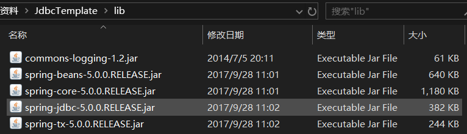

1. 数据库连接池
2. Spring JDBC ：JDBC Template

# 1、数据库连接池

1. 概念：其实就是一个容器（集合），存放数据库连接的容器。

   当系统初始化好后，容器被创建，容器中会申请一些连接对象，当用户来访问数据库时，从容器中获取连接对象，用户访问完之后，会将连接对象归还给容器。

2. 好处：

   1. 节约资源
   2. 用户访问高效

3. 实现：

   1. 标准接口：DataSource	javax.sql包下的
      1. 方法：获取连接getConnection()
      2. 归还连接：如果连接对象Connection时从连接池中获取的，那么调用Connection.close()方法，则不会再关闭连接了，而是归还连接
   2. 一般不去实现它，有数据库厂商来实现
      1. c3p0：数据库连接池技术
      2. Druid：数据库连接池实现技术，阿里巴巴提高的

4. C3P0：数据库连接池技术

   1. 步骤：
      
      1. 导入jar包（两个）：c3p0-0.9.5.4.jar、mchange-commons-java-0.2.15.jar（依赖包）	**数据库驱动jar包记得导入**
      
      2. 定义配置文件：
      
        - 名称：`c3p0.properties` or `c3p0-config.xml` 
      
        - 路劲：直接将文件放在src目录下即可
      
          
          
      
      3. 创建核心对象 数据库连接池对象 ComboPooledDataSource
      4. 获取连接：getConnection
      5. c3p0-config.xml
      
         ```xml
         <c3p0-config>
           <!-- 使用默认的配置读取连接池对象 -->
           <default-config>
           	<!--  连接参数 -->
             <property name="driverClass">com.mysql.cj.jdbc.Driver</property>
             <property name="jdbcUrl">jdbc:mysql://localhost:3306/test?serverTimezone=GMT%2B8</property>
             <property name="user">root</property>
             <property name="password">root</property>
             
             <!-- 连接池参数 -->
         	<!-- 初始化申请的连接数 -->
             <property name="initialPoolSize">5</property>
         	<!-- 最大的连接数 -->
             <property name="maxPoolSize">10</property>
         	<!-- 超时时间 -->
             <property name="checkoutTimeout">3000</property>
           </default-config>
         
           <named-config name="otherc3p0"> 
             <!--  连接参数 -->
             <property name="driverClass">com.mysql.cj.jdbc.Driver</property>
             <property name="jdbcUrl">jdbc:mysql://localhost:3306/test?serverTimezone=GMT%2B8</property>
             <property name="user">root</property>
             <property name="password">root</property>
             
             <!-- 连接池参数 -->
             <property name="initialPoolSize">5</property>
             <property name="maxPoolSize">8</property>
             <property name="checkoutTimeout">1000</property>
           </named-config>
         </c3p0-config>
         ```
      
         
   
5. [Druid](https://github.com/alibaba/druid/releases)：连接池实现技术，有阿里巴巴提供

   - 步骤：
     1. 导入jar包	
     
     2. 定义配置文件：
        - 时properties形式的
        - 可以叫任意名称，可以放在任意目录下
        
     3. 加载配置文件。Properties
     
     4. 获取数据库连接池对象：通过工厂类来获取  DruidDataSourceFactory
     
     5. 获取连接：getConnection
     
     6. druid.properties:
     
        ```
        driverClassName=com.mysql.cj.jdbc.Driver
        url=jdbc:mysql://127.0.0.1:3306/db?serverTimezone=GMT%2B8
        username=root
        password=root
        # 初始化连接数
        initialSize=5
        # 最大连接数
        maxActive=10
        # 最大等待时间，超时时间
        maxWait=3000
        ```
     
   - 定义工具类:
   
     1. 定义一个类 JDBCUtils
   
     2. 提供静态代码块加载配置文件，初始化连接池对象
   
     3. 提供方法
   
        - 获取连接方法：通过数据库连接池获取连接
        - 释放资源
        - 获取连接池的方法
   
        ```java
        import com.alibaba.druid.pool.DruidDataSourceFactory;
        import javax.sql.DataSource;
        import java.io.IOException;
        import java.io.InputStream;
        import java.sql.Connection;
        import java.sql.SQLException;
        import java.util.Properties;
        import java.sql.ResultSet;
        import java.sql.Statement;
        
        /**
         * Druid连接池的工具类
         */
        public class JDBCUtils {
            //1、定义成员变量DataSource
            private static DataSource ds;
        
            static{
                try {
                    //1、加载配置文件
                    Properties pro=new Properties();
                    //使用ClassLoader加载配置文件，获取字节输入流
                    InputStream is = JDBCUtils.class.getClassLoader().getResourceAsStream("druid.properties");
                    pro.load(is);
                    //获取DataSource，初始化连接池对象
                    ds= DruidDataSourceFactory.createDataSource(pro);
                } catch (IOException e) {
                    e.printStackTrace();
                } catch (Exception e) {
                    e.printStackTrace();
                }
            }
        
            //获取数据库连接
            public static Connection getConnection() throws SQLException {
                return ds.getConnection();
            }
        
            //获取连接池方法
            public static DataSource getDataSource(){
                return ds;
            }
            
            //释放资源方法
            public static void Close( Statement stmt,Connection con){
                if (stmt!=null){
                    try {
                        stmt.close();
                    } catch (SQLException e) {
                        e.printStackTrace();
                    }
                }
                if (con!=null){
                    try {
                        con.close();
                    } catch (SQLException e) {
                        e.printStackTrace();
                    }
                }
            }
        
            public static void Close(ResultSet rs, Statement stmt,Connection con){
                if (rs!=null){
                    try {
                        rs.close();
                    } catch (SQLException e) {
                        e.printStackTrace();
                    }
                }
                if (stmt!=null){
                    try {
                        stmt.close();
                    } catch (SQLException e) {
                        e.printStackTrace();
                    }
                }
                if (con!=null){
                    try {
                        con.close();
                    } catch (SQLException e) {
                        e.printStackTrace();
                    }
                }
            }
        }
        ```


# 2、Spring JDBC

Spring框架对JDBC的简单封装。提供了一个JdbcTemplate对象简化JDBC的开发

步骤：

1. 导入jar包

   

2. 创建JdbcTemplate对象。依赖于数据源DataSource

   JdbcTemplate template=new JdbcTemplate();

3. 调用JdcbTemplate的方法来完成crud操作

   - update()：执行DML语句。增、删、改语句
   - queryForMap()：查询结果将结果集封装为list集合
   - queryForList()：查询结果将结果集封装为list集合
   - query()：查询结果，将结果封装为JavaBean对象
   - queryForObject：查询结果，将结果封装为对象


